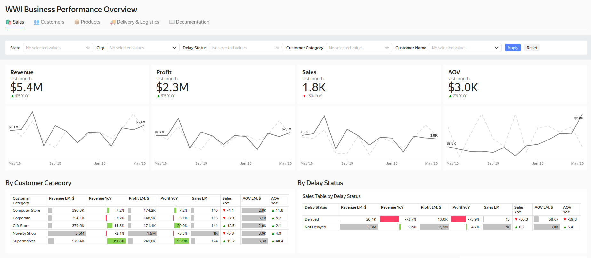
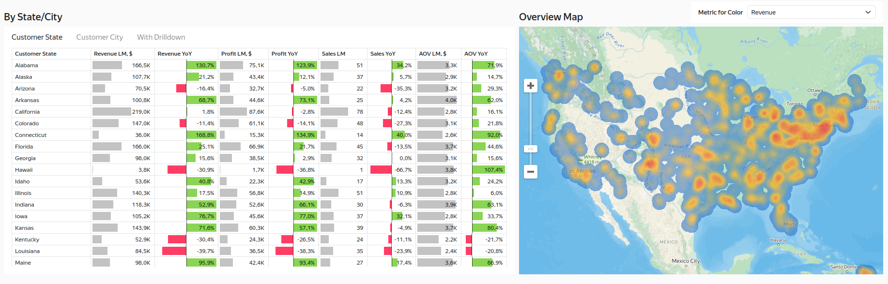
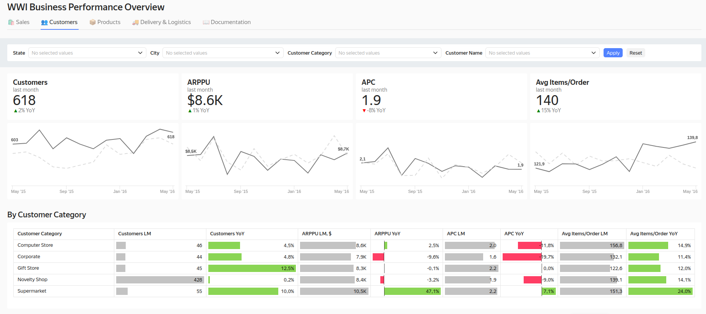
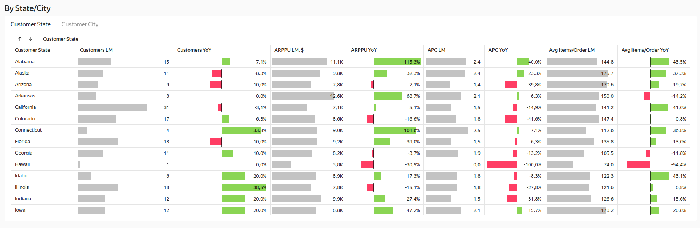
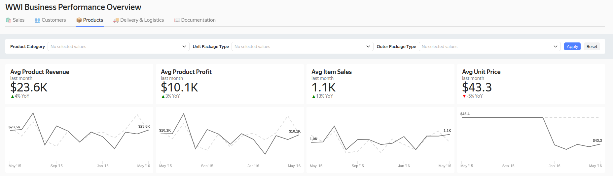
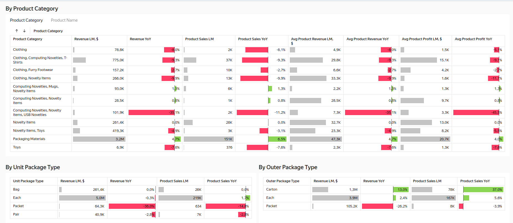
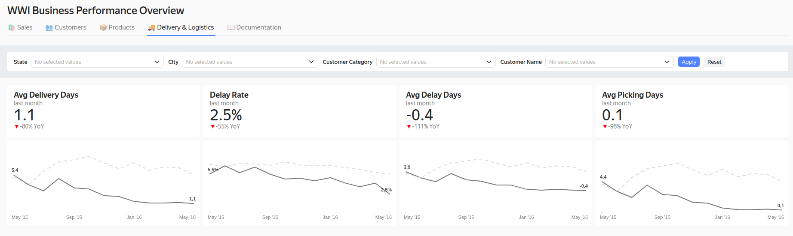
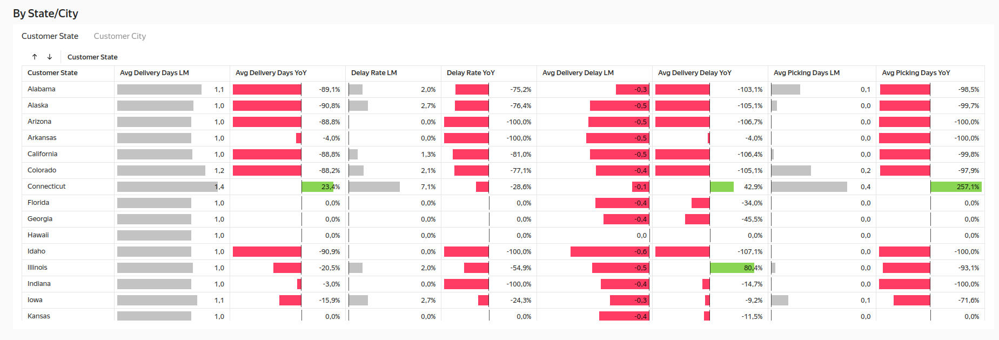

# 🌐 WWI Data Pipeline and Dashboard

[](https://github.com/PavelGrigoryevDS/wwi-data-pipeline-dashboard/blob/main/pyproject.toml)
[](https://pavelgrigoryevds.github.io/wwi-data-pipeline-dashboard/)
[](https://github.com/PavelGrigoryevDS/wwi-data-pipeline-dashboard/blob/main/wwi-data-pipeline-dashboard.ipynb)
[](https://opensource.org/licenses/MIT)

End-to-end data pipeline and interactive dashboard for Wide World Importers. Features ETL process, star schema data warehouse, and business performance analytics.

**📖 For comfortable reading:** [Web version](https://pavelgrigoryevds.github.io/wwi-data-pipeline-dashboard/)

<a id="contents"></a>

## 📑 Contents

- [🔗 Project Resources](#project-resources)
- [🛠️ Tech Stack \& Methods](#tech-stack-methods)
- [📌 Project Overview](#project-overview)
- [🗃️ Data Source](#data-source)
- [🎯 Main Conclusions](#main-conclusions)
- [📊 Dashboard Preview](#dashboard-preview)
- [🚀 How to Run This Project](#how-to-run-this-project)
- [📜 License](#license)
  
---

<a id="project-resources"></a>

## 🔗 Project Resources

- **[**Dashboard**](https://datalens.yandex/42t45uco5jxup)** - WWI Business Performance Overview Dashboard
- **[Source Notebook](https://github.com/PavelGrigoryevDS/wwi-data-pipeline-dashboard/blob/main/wwi-data-pipeline-dashboard.ipynb)** - Jupyter notebook with full report

[⬆ back to contents](#contents)

---

<a id="tech-stack-methods"></a>

## 🛠️ Tech Stack & Methods

**Stack:**

- **Data & Databases:** `Python` `SQL` `PostgreSQL` `Sqlalchemy` `DBLink`
- **Analytics & BI:** `Yandex DataLens`
- **Automation:** `Airflow`

**Methods & Technologies**:

- **Database Management**: 
  - PostgreSQL with OLTP to OLAP transformation
- **ETL Pipeline Development**: 
  - Automated data extraction, transformation, and loading processes
- **Data Warehouse Design**: 
  - Star schema implementation for analytical queries
- **SQL Optimization**: 
  - Complex queries, materialized views, and index optimization
- **Data Modeling**: 
  - Dimension and fact table design for business intelligence
- **Business Intelligence**: 
  - Interactive dashboard development in Yandex DataLens
- **Automation**: 
  - Airflow DAG design for daily data pipeline execution
- **Data Integration**: 
  - Cross-database communication using DBLink extension
- **Performance Optimization**: 
  - Query tuning and materialized view implementation
- **Cloud Database Deployment**: 
  - Cloud PostgreSQL deployment and management
  
[⬆ back to contents](#contents)

---

<a id="project-overview"></a>

## 📌 Project Overview

Wide World Importers (WWI) is a global distributor of consumer goods, dealing with suppliers and clients worldwide.

WWI aims to enhance the visibility of key business performance indicators for rapid decision-making. Currently, data is siloed across the operational database, and management spends significant time manually compiling reports, leading to delayed and inefficient insights.

**Project Goal:**  

To build an automated, end-to-end analytics pipeline and an interactive dashboard. This system will provide leadership and the sales, procurement, and logistics departments with a single source of truth for key metrics related to sales performance and delivery efficiency.

**Expected Outcome:**

The final dashboard will drastically reduce data analysis time, enable the identification of trends and anomalies, and support strategic and operational decision-making based on accurate, consolidated information.

[⬆ back to contents](#contents)

---

<a id="data-source"></a>

## 🗃️ Data Source

The official Microsoft Wide World Importers sample database (OLTP schema) [Microsoft](https://learn.microsoft.com/en-us/sql/samples/wide-world-importers-what-is?view=sql-server-ver17)

[⬆ back to contents](#contents)

---

<a id="main-conclusions"></a>

## 🎯 Main Conclusions

- End-to-End Pipeline Delivered: Successfully built an analytics pipeline from the raw OLTP database to a optimized star schema data mart.
- Process Automation Engineered: Designed and implemented an automated daily ETL process for incremental data updates.
- Interactive Dashboard Developed: Created a centralized, interactive dashboard for key sales and logistics performance metrics.
- Goal Achieved: The solution provides stakeholders with immediate, data-driven insights, eliminating the need for manual reporting and enabling faster, informed decision-making.

[⬆ back to contents](#contents)

---

<a id="dashboard-preview"></a>

## 📊 Dashboard Preview

[👉 WWI Business Performance Overview Dashboard](https://datalens.yandex/42t45uco5jxup)

Here are the key screenshots of the implemented dashboard:

### 🛍️ Sales

Main page with key sales metrics, YoY growth, and geographical distribution.





### 👥 Customers

Customer metrics.





### 📦 Products

Analyzes product performance. 





### 🚚 Delivery & Logistics

Delivery time analysis, delay statistics, and operational efficiency.





[⬆ back to contents](#contents)

---

<a id="how-to-run-this-project"></a>

## 🚀 How to Run This Project

### Prerequisites

- Python 3.11+ installed
- Git (for cloning)
- PostgreSQL (local or cloud)
  
### Clone the Repository

```bash
git clone https://github.com/PavelGrigoryevDS/wwi-data-pipeline-dashboard.git
cd wwi-data-pipeline-dashboard
```

###  Database Deployment

To reproduce this project, you'll need to create 2 empty PostgreSQL databases:

- One for the source database (WWI dump)
- One for the analytical database

#### Creating Empty PostgreSQL Databases

##### Option 1: Local PostgreSQL
1. **Install PostgreSQL**:
   - [Download PostgreSQL](https://www.postgresql.org/download/) for your OS
   - Or use Docker:
     ```bash
     docker run --name wwi_db -e POSTGRES_PASSWORD=mysecretpassword -p 5432:5432 -d postgres
     ```

##### Option 2: Cloud Services (Free Tier)
Choose one of these services:
- [Neon.tech](https://neon.tech/) 
- [Supabase](https://supabase.com/) 
- [Render](https://render.com/)

#### Restoring the Database

Next you'll need to restore the database from the provided dump file. You can use either a local PostgreSQL instance or a cloud service.

The database dump file is located in the `assets` folder named `wide_world_importers_pg.dump`

Use this command to restore the dump file:

```bash
pg_restore \
  -h [HOST] \          # For cloud: your-db-host.url.com | For local: localhost
  -U [USERNAME] \      # For cloud: your_db_owner | For local: postgres
  -d [DATABASE_NAME] \ # Database name (check your cloud provider)
  -Fc \                # Specifies custom format dump
  --no-owner \         # Ignores ownership permissions
  --no-privileges \    # Ignores privilege assignments
  assets/wide_world_importers_pg.dump
```

### Environment Configuration

Create a `.env` file in the project root directory with your database connection details:

```env
# Source Database
WWI_NEON_HOST=your_source_host
WWI_NEON_DB=your_source_db
WWI_NEON_USER=your_source_user
WWI_NEON_PASSWORD=your_source_password
WWI_NEON_SSLMODE=require
WWI_NEON_CHANNEL_BINDING=disable

# Analytical Database
WWI_ANALYTICS_NEON_HOST=your_analytics_host
WWI_ANALYTICS_NEON_DB=your_analytics_db
WWI_ANALYTICS_NEON_USER=your_analytics_user
WWI_ANALYTICS_NEON_PASSWORD=your_analytics_password
WWI_ANALYTICS_NEON_SSLMODE=require
WWI_ANALYTICS_NEON_CHANNEL_BINDING=disable
```

### Install and Run

- If Poetry is NOT installed on your system, use Option 1
- If Poetry IS installed, use Option 2

#### Option 1: Using pip + virtualenv

```bash
python -m venv .venv
source .venv/bin/activate  
pip install poetry
poetry config virtualenvs.in-project true --local
poetry install
jupyter lab wwi-data-pipeline-dashboard.ipynb
```

#### Option 2: Poetry

```bash
poetry config virtualenvs.in-project true --local
poetry install
poetry run jupyter lab wwi-data-pipeline-dashboard.ipynb
```
[⬆ back to contents](#contents)

---

<a id="license"></a>

## 📜 License  

This analysis is shared under [MIT License](LICENSE).  